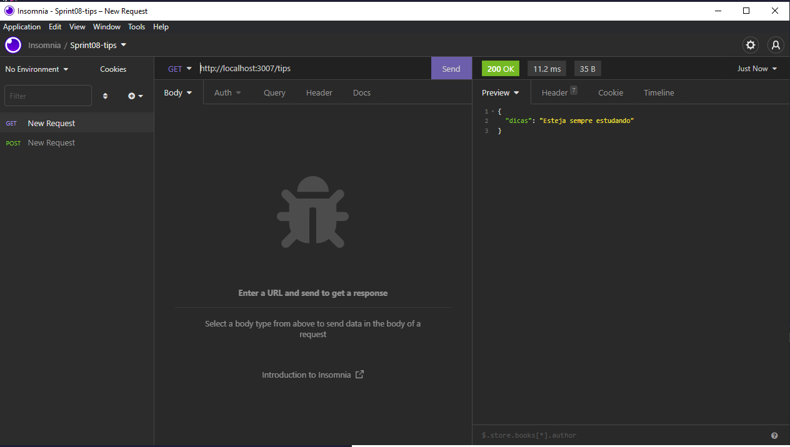
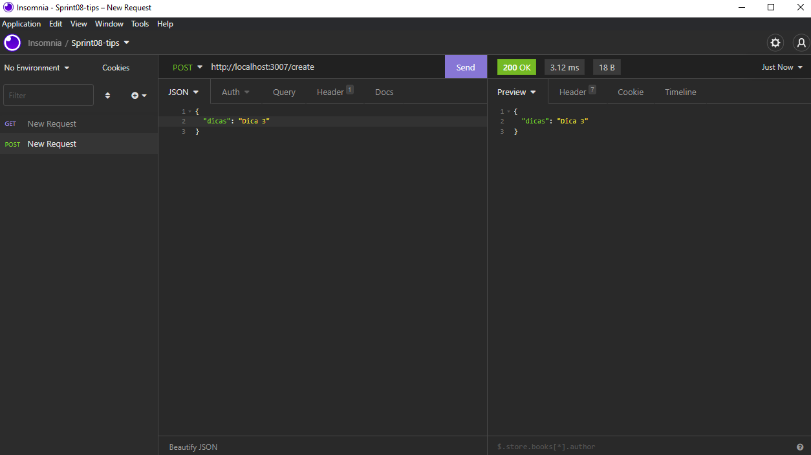

<h2 align="center">Sprint 8 - módulo IV - Ferramenta de apoio para o dia a dia do Dev?</h2>

 Como é o projeto:

 ◆ A ideia é criar duas rotas em nossa aplicação, uma delas vai receber uma dica e
gravar essa dica no banco de dados e a outra rota deve devolver de forma
aleatória uma das dicas que estão armazenadas no banco. Vamos usar a rota
/create para salvar a dica e uma rota /tips para devolver uma dica aleatória.

 Resultado:

 

 

 
Tecnologias utilizadas:

- Javascript
- Node.js
- NPM
- Biblioteca: 'express'
